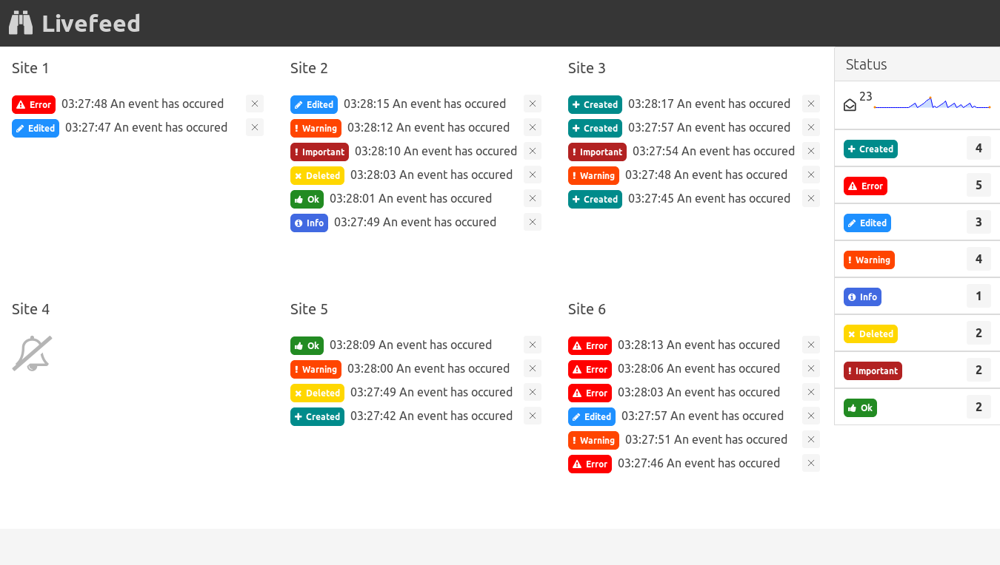

Django Mqueue Livefeed
======================

A demo showing how to monitor events coming from multiple Django sites via websockets

Dependencies
------------

- [Django Mqueue](https://github.com/synw/django-mqueue): the events queue for Django.
- [Centrifugo](https://github.com/centrifugal/centrifugo): the websockets server.
- [Django Instant](https://github.com/synw/django-instant): the Centrifugo <-> Django layer

Install
-------

Clone the repository and install the packages:

   ```
   pip install -r requirements.txt
   ```

Use the installer to get the and configure a local websockets server:

   ```
   python backend/manage.py install
   ```

Or install the Centrifugo websockets server [manualy](https://github.com/synw/django-instant#quick-start)
and configure the Django settings

Initialize
----------

Migrate, create a superuser. Then initialize the database with this command:

   ```
   python backend/manage.py migrate
   python backend/manage.py createsuperuser
   python backend/manage.py init_db
   ```
  
It will generate 6 sites in the admin and the websockets channel

Run
---

Run the websockets server:

   ```
   python backend/manage.py runws
   ```

In another terminal run the backend dev server:

   ```
   python backend/manage.py runserver
   ```

Open the frontend at localhost:8000 and login with your superuser

In another terminal auto generate events for the demo:

   ```
   python backend/manage.py feed_mq
   ```
  
Watch the events coming in the frontend

Architecture
------------

The frontend is a Vuejs 3 Typescript app running on Vitejs. It is compiled to be served by
Django as static files and an *index.html* template.

To install the frontend for dev mode:
   ```
   yarn install
   ```

To run the frontend with Vitejs in dev mode on localhost:3000:

   ```
   yarn dev
   ```

To compile the frontend to Django template and static files:

   ```
   yarn build
   ```

Screenshot
----------



