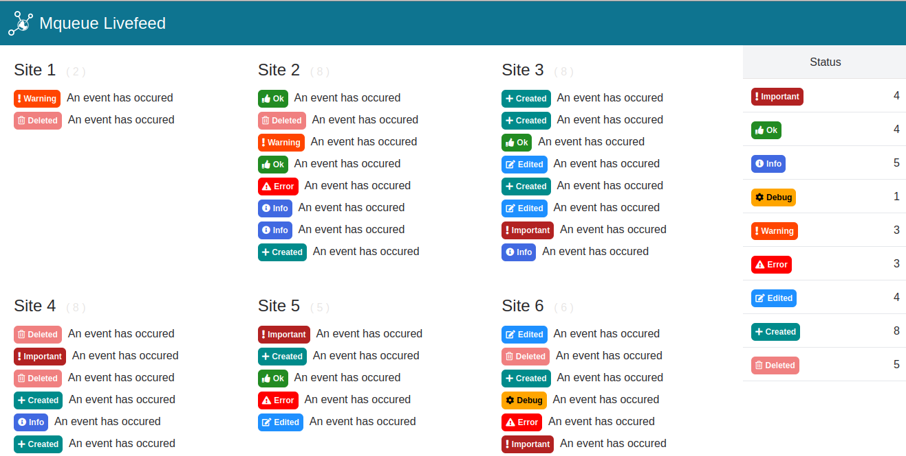

Django Mqueue Livefeed
======================

A demo showing how to monitor events coming from Django sites via websockets with [django-mqueue](https://github.com/synw/django-mqueue)
and [django-instant](https://github.com/synw/django-instant). Two versions are available:

- [Single page app](#single-page-app) with Vuejs
- [Template demo](#template-demo) with Alpinejs


Install
-------

Clone the repository and install the project:

   ```
   make install
   ```

This will install the backend and a local Centrifugo websockets server for the demo

Or install the Centrifugo websockets server [manualy](https://github.com/synw/django-instant#quick-start)
and configure the Django settings

Template demo
-------------

Run the http server:

   ```
   make run
   ```

Run the websockets server in another terminal:

   ```
   make runws
   ```

Open the frontend at localhost:8000 and login with your superuser

In another terminal auto generate events for the demo:

   ```
   make pushevents
   ```
  
Watch the events coming in the frontend

Single page app
---------------

Run the same commands as above and click the spa link in frontend to see the
compiled demo. To run it in dev mode and build it read the instructions below.

The frontend is a Vuejs 3 Typescript app running on Vitejs. It is compiled to be served by
Django as static files and an *index.html* template.

To install the frontend for dev mode:
   ```
   yarn install
   ```

To run the frontend with Vitejs in dev mode on localhost:3000:

   ```
   yarn dev
   ```

To compile the frontend to Django template and static files:

   ```
   yarn build
   ```

Screenshot
----------



